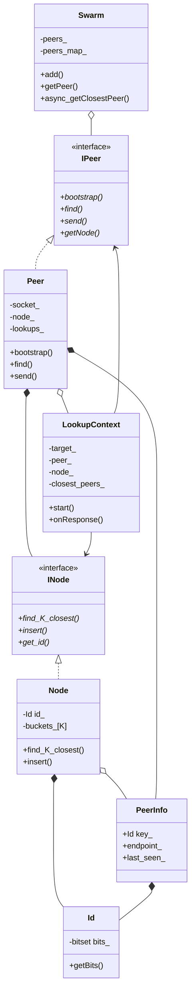

# KD Project - Simplified UML

## Основные компоненты

**Данные:**
- `Id` - идентификатор узла (bitset)
- `PeerInfo` - информация о пире (ID + endpoint)

**Интерфейсы:**
- `INode` - таблица маршрутизации
- `IPeer` - сетевой пир

**Реализации:**
- `Node` - k-buckets для DHT
- `Peer` - UDP-пир с сокетом

**Управление:**
- `Swarm` - менеджер всех пиров (singleton)
- `LookupContext` - итеративный поиск узлов
